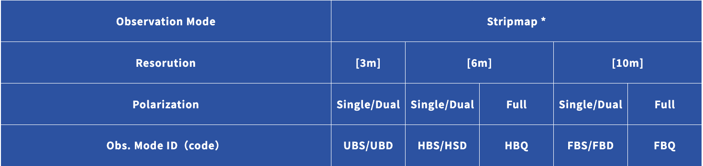

# ALOS2-Flood-Mapping

This repositary includes a statistical based flood mapping approch for ALOS2 Level 2.1 data.

#### source: https://alos-pasco.com/en/alos-2/spec/

# Python 3.9.7

These scripts were writen in Python version 3.9.7 and requirement.txt includes all the necessary packages to be installed  to run the script.

