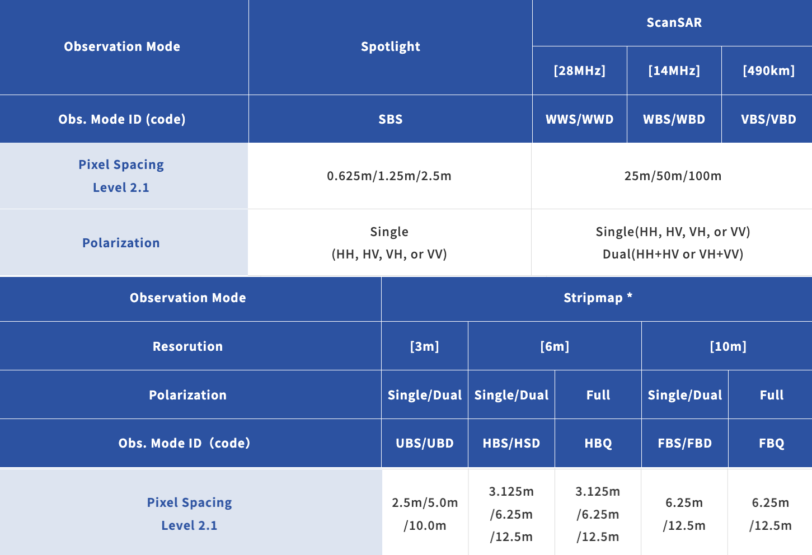
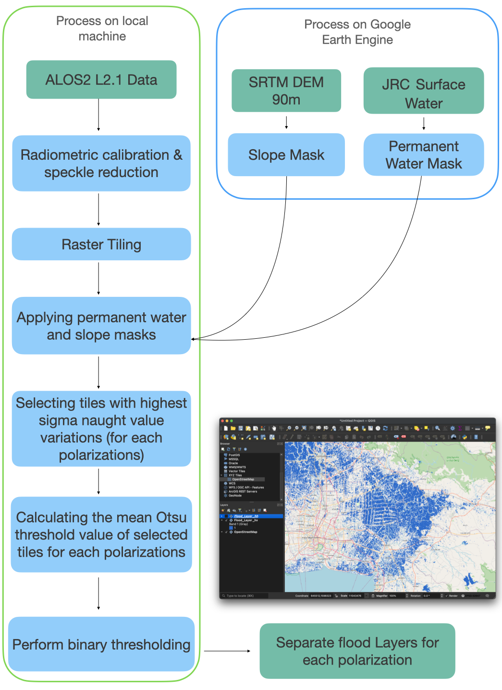

# ALOS2-Flood-Mapping

This repository includes an automatic statistical-based flood mapping approach for ALOS2 Level 2.1 data. (Geometrically corrected and orthorectified data in .tif format).The below chart gives a brief overview of ALOS2 L2.1 data.

source: https://alos-pasco.com/en/alos-2/spec/

The flood extraction process is carried out in a local machine with the help of additional data from the Google Earth Engine. The picture below shows the methodology carried out to obtain flood layers.

Jupyter notebooks in this repository use Python version 3.9.7. Moreover, the requirement.txt includes all the necessary packages to be installed to run these notebooks. Helper_Functions.ipynb contains all the functions required for the ALOS2_Flood_Extraction.ipynb
